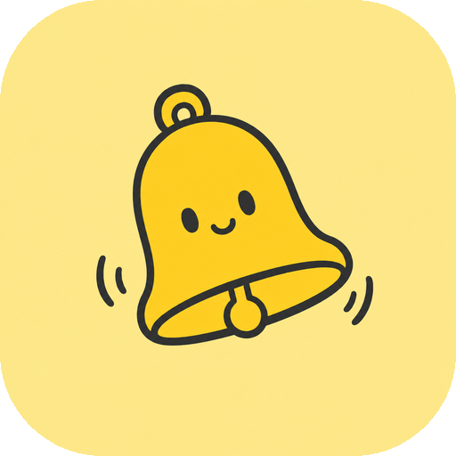

<p align="center"></p>

# SessionBell

**Your coding agents, on your lock screen.**

SessionBell puts Claude Code on your iPhone: push notifications when a
session needs you, a
lock-screen Live Activity dashboard aggregating tasks across all your Macs,
one-tap permission approvals, remote terminal control, and official usage stats.

[中文说明 → README.zh-CN.md](README.zh-CN.md)

```
┌─ Mac #1 ─┐
│ CC hooks ─┼──HTTPS──┐
└───────────┘         ▼
┌─ Mac #2 ─┐   Cloudflare Worker ──APNs──▶ iPhone
│ CC hooks ─┼──▶    + D1 (kv)             lock screen card · notifications
└───────────┘         ▲                   approve / deny · remote commands
                      └──────HTTPS──────── iPhone app
```

The Mac integration uses a single zero-dependency Python script: Claude Code
lifecycle hooks plus a background relay for phone commands and state. Opt-in
Codex support adds a shared CLI app-server and a native desktop observer.
The backend is a Cloudflare Worker with one D1 table.

## What it does

- **Push notifications** — session waiting for input, task finished, permission
  requested. Idle detection means no noise while you're at the keyboard.
- **Lock-screen dashboard** — a Live Activity card showing every running /
  waiting / finished task across all paired Macs, with live timers.
- **Approve from your phone** — `PermissionRequest` hooks push an actionable
  card; Allow/Deny buttons on the lock screen answer the prompt on your Mac
  (falls back to the terminal after a timeout).
- **Remote control** — send text into a session's real terminal (iTerm /
  Terminal.app) from the phone, read back the tail, resurrect ended sessions
  with `claude -c`.
- **Usage dashboard** — your official Claude usage limits (weekly / per-model),
  fetched from the same source as `/usage`, no manual calibration.
- **Codex on macOS (pilot)** — track native desktop tasks, completion and session
  tokens alongside Claude. Shared CLI sessions support approvals, questions,
  follow-ups and new tasks, with official account quotas. Original desktop
  follow-ups are an opt-in, version-pinned private-protocol pilot.
  Requires the updated relay, backend and iOS app; see the
  [integration and validation notes](docs/codex-integration.md).
  The product focus is a cross-agent lock-screen overview; see
  [how this differs from Codex Remote](docs/codex-remote-comparison.md).

## Two ways to run it

### Hosted (10 minutes, no Apple account)

Someone runs a backend and invites you:

1. Open the join page you were given, enter the invite code → you get a
   personal **pairing code**.
2. Install the iOS app via TestFlight → paste the pairing code in 后端配置.
3. Download the signed `SessionBell.pkg` → run `sessionbell pair <code>`.

**Windows** (beta): copy the pairing command on your iPhone, then in PowerShell:

```powershell
[Net.ServicePointManager]::SecurityProtocol = [Net.SecurityProtocolType]::Tls12
irm https://sessionbell.westie.ai/install.ps1 | iex
```

This installs `sessionbell.exe` (a thin launcher around the same
`sessionbell_hook.py` every Mac runs — self-update covers both platforms),
wires the Claude Code hooks, and registers the watcher at logon.
Notifications, the lock-screen card, approvals, usage, and terminal mode
all work; terminal mode addresses the session's console by pid via
`AttachConsole`/`ReadConsoleOutput`/`WriteConsoleInput` — focus-independent,
so it never types into whatever window you're using. Claude running inside
WSL is not covered by terminal mode yet.

Data isolation: your namespace is `sha256(secret)` — tenants are physically
separated rows in D1 and the push gateway only pushes to devices registered in
your own namespace. If that isn't enough trust, self-host — that's why this
repo is open.

### Self-hosted (~1 hour, one-time)

Prerequisites: paid Apple Developer account, Xcode, iPhone (iOS 17.2+), free
Cloudflare account.

**1. Apple** — developer.apple.com:
create an APNs Auth Key (download the `.p8`, note Key ID + Team ID), register
your own App ID with Push Notifications enabled.

**2. Backend** — `backend-cf/`:

```bash
cd backend-cf
# edit wrangler.jsonc: your account_id, drop/replace the routes block
npx wrangler d1 create sessionbell            # put the id in wrangler.jsonc
npx wrangler d1 execute sessionbell --remote --file schema.sql
npx wrangler secret put APNS_KEY < AuthKey_XXXX.p8
npx wrangler secret put APNS_KEY_ID
npx wrangler secret put APNS_TEAM_ID
npx wrangler secret put INVITE_CODE           # any string; gates /api/signup
npx wrangler deploy
```

**3. Mac**:

```bash
mkdir -p ~/.sessionbell && cp mac/config.example.json ~/.sessionbell/config.json
# fill in: backend_url + backend_secret (mint one: openssl rand -hex 24),
# and if you want the Mac to sign APNs pushes itself: team_id / key_id / p8_path
bash mac/setup.sh        # installs hooks, starts the watcher
```

**4. iOS app**:

```bash
cd ios
# project.yml: set PRODUCT_BUNDLE_IDENTIFIER + DEVELOPMENT_TEAM to yours
xcodegen generate
# open in Xcode, ⌘R onto your iPhone, allow notifications
```

In the app, expand 后端配置, enter your Worker URL + secret, hit 测试连接.
Then `python3 mac/sessionbell_hook.py test` — your phone should ring.

Note: a Debug self-signed install expires after 7 days; upload your own
TestFlight build for long-term use. Extra Macs: repeat step 3 only.

## Repository layout

| Path | What it is |
|---|---|
| `mac/sessionbell_hook.py` | All Mac-side logic, zero pip dependencies: lifecycle hooks, session state, terminal registry, AppleScript inject/capture, APNs, official usage fetch, Codex setup |
| `ios/` | SwiftUI app + Widget extension (xcodegen project): Live Activity card with physical Allow/Deny buttons, task list, terminal view, usage bars |
| `backend-cf/` | Cloudflare Worker + D1: token registry, decision mailbox, cross-Mac state sync, APNs gateway, signup/join page, static assets |
| `backend/` | **Deprecated** legacy Vercel backend, kept for reference |

## Hooks reference

### Codex (macOS)

After pairing SessionBell, run:

```bash
python3 ~/.sessionbell/sessionbell_hook.py codex-enable
# Connect CLI sessions to the shared service; leave the desktop unchanged:
codex --remote unix://
```

The installer also accepts `SB_CODEX=1` as an explicit opt-in. Setup backs up
existing configuration and installs a CLI launchd service over a user-owned Unix
socket. It does not expose a TCP port or change the desktop transport. The relay
reads the native desktop's local session records without taking ownership.

For shared CLI sessions, select Codex on the phone's new-task screen. Follow-ups wait until the current
turn is idle. Approvals are available on the lock screen and in the task;
structured questions are answered individually in the task view. Existing
independent sessions must finish their active turn before being opened on the
shared service; SessionBell never silently resumes them on a second server.
Desktop task pages show source and cumulative token counts. Monitoring is the
default; supported builds can opt into original-conversation follow-ups with
`codex_desktop_followup: true` in the relay configuration. This uses an internal
desktop protocol, queues input until the turn finishes, and falls back to
monitoring on unsupported builds. Native desktop approvals/questions, cancellation,
and archived-session reopening are not covered by this follow-up pilot.
Optional `codex-setup` registers a desktop permission hook requiring normal Codex
hook review/trust; real native desktop approval round trips remain unverified.
The Codex integration is a local pilot, not a public installer/App Store release.

### Claude Code

`mac/setup.sh` installs these into `~/.claude/settings.json`; for manual setup:

```json
"UserPromptSubmit": [{ "hooks": [{ "type": "command", "command": "<repo>/mac/sessionbell_hook.py prompt",       "timeout": 30,  "async": true }] }],
"Notification":     [{ "hooks": [{ "type": "command", "command": "<repo>/mac/sessionbell_hook.py notification", "timeout": 30,  "async": true }] }],
"Stop":             [{ "hooks": [{ "type": "command", "command": "<repo>/mac/sessionbell_hook.py stop",         "timeout": 120 }] }],
"SessionEnd":       [{ "hooks": [{ "type": "command", "command": "<repo>/mac/sessionbell_hook.py session-end",  "timeout": 30,  "async": true }] }],
"PermissionRequest":[{ "hooks": [{ "type": "command", "command": "<repo>/mac/sessionbell_hook.py permission",   "timeout": 120 }] }],
"PreToolUse":       [{ "matcher": "Task|Agent", "hooks": [{ "type": "command", "command": "<repo>/mac/sessionbell_hook.py subagent-start", "timeout": 30, "async": true }] }],
"SubagentStop":     [{ "hooks": [{ "type": "command", "command": "<repo>/mac/sessionbell_hook.py subagent-stop", "timeout": 30, "async": true }] }]
```

`PermissionRequest` and `Stop` must **not** be async: the first returns the
approval decision on stdout, the second injects remote phone commands. Neither
slows you down when you're at the keyboard.

## Security model

- The Mac hook sends: project name, host name, session status, prompt/detail
  summaries, and — only when you explicitly use the phone terminal — captured
  terminal tail. Nothing else leaves the machine.
- Backend auth is a single per-tenant secret in the `x-sb-secret` header;
  namespace = `sha256(secret)[:16]`. The Worker never stores plaintext secrets.
- APNs keys live only as Cloudflare secrets (hosted) or in `~/.sessionbell`
  (self-host). Nothing sensitive is baked into the repo or the app binary.
- Remote terminal injection only targets sessions registered by your own
  hooks, resolved by tty at prompt time.

## Known quirks

- Live Activity push-to-start has a system rate budget; rapid re-testing gets
  silently dropped (APNs still returns 200). Use the in-app 唤起面板 button.
- The notification icon is cached by iOS; changing the app icon needs a phone
  restart to show up there.
- Wireless debugging drops when the iPhone sleeps; wake it or use a cable.

## License

[MIT](LICENSE)
